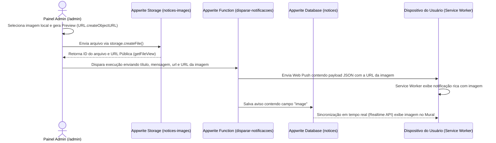

# Manual de Uso Técnico: Sistema Web Push Sportshot

Bem-vindo ao manual técnico do **Sportshot PWA**. Este documento é voltado para desenvolvedores e administradores de infraestrutura (como você) e detalha o funcionamento, arquitetura, esquema do banco de dados, storage e processo de integração contínua (CI/CD) para manutenção da plataforma.

---

## 1. Arquitetura Geral do Sistema

O sistema é construído sobre uma arquitetura moderna e de alto desempenho:
1. **Frontend (React + Vite + TypeScript)**: Um Progressive Web App (PWA) leve, otimizado para celulares e desktops, que realiza o registro de assinaturas Web Push e consome APIs do Appwrite em tempo real.
2. **Backend (Appwrite Server & Appwrite Functions)**:
   - **Database**: Armazena as assinaturas de push (coleção `push_subscribers`) e o histórico de avisos enviados (coleção `notices`).
   - **Storage**: Hospeda os arquivos de imagens enviados pelo administrador (bucket `notices-images`).
   - **Functions**: A função `disparar-notificacoes` é responsável por processar o envio em lote via Web Push de forma assíncrona, limpar tokens inválidos e registrar o mural.
3. **Service Worker (`sw.js`)**: Executado em plano de fundo no dispositivo do cliente para escutar eventos de Push do sistema operacional, renderizar notificações ricas (incluindo imagens) e gerenciar redirecionamentos personalizados ao clicar.

---

## 2. Fluxo Técnico de Inserção de Imagens

O sistema utiliza a API do Appwrite Storage para permitir o envio nativo de arquivos de imagens pelo administrador, integrando-a com as notificações Web Push ricas:



---

## 3. Estrutura do Banco de Dados e Storage

As coleções estão localizadas no banco de dados `sportshot-db`.

### Coleção: `notices` (Histórico de Avisos)
Armazena todos os disparos que aparecem no Mural de Avisos da página inicial.
- **`title`**: String (255, obrigatório) — Título da notificação.
- **`body`**: String (2048, obrigatório) — Conteúdo/mensagem do aviso.
- **`url`**: String (2048, opcional) — Link de destino personalizado (default `/`).
- **`sender`**: String (255, opcional) — Nome/e-mail do administrador que disparou.
- **`image`**: String (2048, opcional) — Link público da imagem hospedada no Appwrite Storage.
- **`createdAt`**: String (64, obrigatório) — Timestamp ISO da criação.

### Storage Bucket: `notices-images` (Armazenamento de Imagens)
Diretório de arquivos onde são armazenadas as imagens enviadas no painel.
- **Bucket ID**: `notices-images`
- **Permissões de Leitura**: Pública (`Role.any()`) para que os navegadores carreguem as imagens nas notificações e no mural.
- **Permissões de Escrita**: Permissões públicas/usuários autenticados (`Role.any()`) para viabilizar o upload direto via SDK Web do frontend do painel administrativo.
- **Segurança de Arquivo (File Security)**: Desabilitado (o controle é centralizado no nível do bucket).

---

## 4. Scripts de Setup & Migração do Appwrite

Para atualizar ou configurar a infraestrutura técnica em novos servidores, use os scripts presentes na pasta `/scratch` e `/scripts` (requer a variável `APPWRITE_API_KEY` definida no ambiente):

### A. Setup Inicial Completo (Banco e Estrutura)
Cria o banco de dados `sportshot-db`, o usuário administrador inicial e a coleção de inscrições:
```bash
$env:APPWRITE_API_KEY="SUA_CHAVE"; node scripts/setup-appwrite.js
```

### B. Migração de Imagem & Storage (Atualização de Esquema)
Executa a migração do banco de dados adicionando o atributo `image` à coleção `notices` e cria o bucket de armazenamento `notices-images` no Appwrite Storage de forma automática:
```bash
$env:APPWRITE_API_KEY="SUA_CHAVE"; node scratch/update-schema-image.js
```

---

## 5. Como Atualizar o Sistema Online (Pipeline de CI/CD)

A infraestrutura na VPS Hetzner está configurada com integração contínua (CI/CD) via Portainer Webhook ligada diretamente ao repositório GitHub.

Sempre que realizar modificações de código localmente e testar em ambiente de desenvolvimento, siga estes passos para colocar as alterações online em produção:

### 1. Empacotar a Appwrite Function (se houver alteração em `/functions`)
Se você alterou a lógica de backend em `functions/disparar-notificacoes/src/index.js`, gere novamente o pacote de deploy:
- **No Windows (PowerShell)**:
  ```powershell
  tar -czf function-deploy.tar.gz -C functions/disparar-notificacoes package.json package-lock.json src
  ```
- **Fazer upload do novo backend**:
  ```powershell
  node scripts/deploy-function.mjs
  ```

### 2. Enviar Modificações do Frontend para o GitHub
Para que as alterações no painel do administrador, mural ou estilizações entrem no ar:
```bash
# Adicionar todas as alterações
git add .

# Realizar o commit
git commit -m "feat: descrição curta da sua modificação"

# Enviar para a branch de produção
git push origin master
```

### 3. Build Automático no Servidor
Ao realizar o `git push origin master`, o GitHub aciona o Portainer na sua VPS via Webhook. O Portainer irá:
- Baixar a versão mais recente do repositório.
- Executar o container Builder (`npm run build` interno no Dockerfile).
- Substituir o container de produção (`Nginx`) sem queda no serviço.
- Em cerca de 1 minuto, a alteração estará online de forma 100% automatizada.

---

## 6. Configurações de Deploy (Nginx & Docker)
O frontend é servido via Docker com Nginx. O arquivo [nginx.conf](file:///c:/Users/ivens/OneDrive/Desktop/_Algoritimos/sportshot.simplemsg.net.br/nginx.conf) está configurado para habilitar cache agressivo de Service Workers e ativos estáticos, além de redirecionar todas as rotas internas para `index.html` para compatibilidade com o React Router.

Qualquer alteração em portas ou proxies reversos virtuais deve ser gerenciada no arquivo [docker-compose.yml](file:///c:/Users/ivens/OneDrive/Desktop/_Algoritimos/sportshot.simplemsg.net.br/docker-compose.yml).
